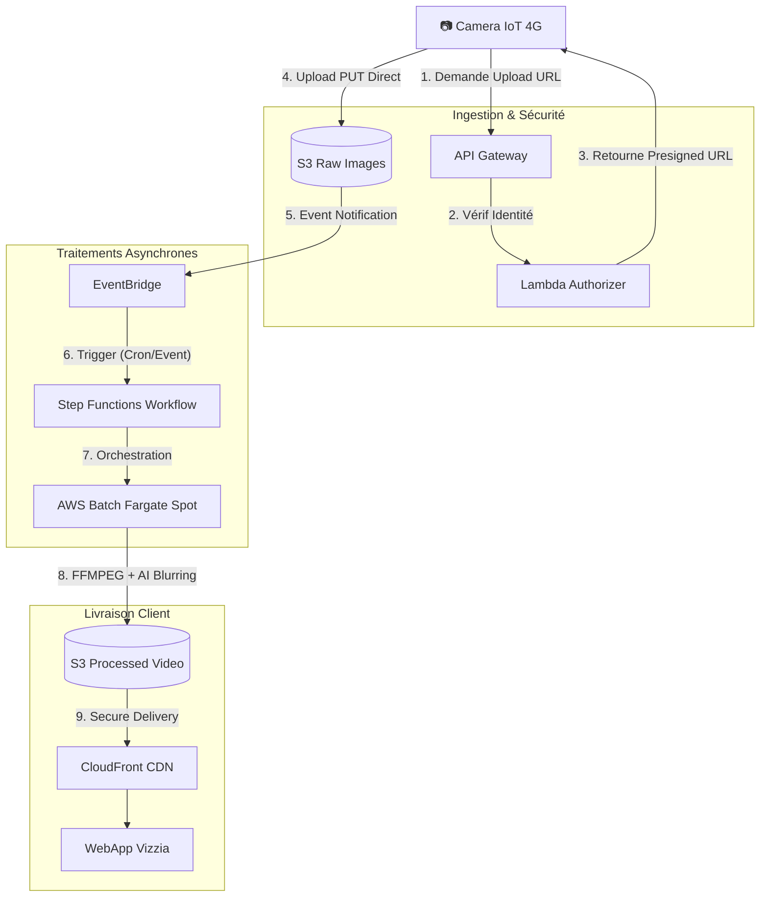

# 🎯 Corrigé Type : Entretien Senior Cloud Engineer (Vizzia)

## 🛠️ Partie 1 : Code Review & Refactoring (La réponse attendue)

**Ton attitude :** Bienveillante mais intransigeante sur la prod. Tu dois montrer que tu as vu le piège principal (Pagination S3) et que tu penses aux coûts/performances.

### 1. Le "Showstopper" (Bug Critique)
> **Candidat :** *"Il y a un bug fonctionnel majeur ici. La méthode `ListObjectsV2` de l'AWS SDK retourne **maximum 1000 objets** par défaut. Comme vos caméras envoient 1 image par minute (1440/jour), ce code rate systématiquement les 440 dernières images de la journée. La vidéo sera incomplète. Il faut impérativement implémenter une boucle de pagination en vérifiant `IsTruncated` et en utilisant le `NextContinuationToken`."*

### 2. Performance & Concurrence
> **Candidat :** *"Le code télécharge les images une par une (séquentiel). C'est inefficace et cela augmente le temps d'exécution (donc le coût Lambda).*
> *   **En Go :** Il faut utiliser des `Goroutines` avec un `sync.WaitGroup` ou un `Worker Pool` pour paralléliser les téléchargements (ex: 20 à la fois).
> *   **En Python/TS :** Utiliser `Promise.all` ou `ThreadPoolExecutor`."*

### 3. Gestion Mémoire & Disque (Stabilité)
> **Candidat :** *"On stocke tout dans `/tmp`. Si on traite de la HD, on risque de remplir le disque (même avec les 10GB éphemères, c'est risqué et payant). De plus, le `defer` dans la boucle `for` (en Go) crée une fuite de mémoire car les fichiers ne sont fermés qu'à la fin de la fonction."*

### 4. Sécurité (Security First)
> **Candidat :** *"L'utilisation de `ACL: public-read` est critique. Cela rend les vidéos accessibles à n'importe qui scannant le bucket. Il faut bloquer l'accès public au niveau du compte/bucket et servir les fichiers via **CloudFront** avec des **Signed URLs** ou des **Signed Cookies**."*

### 5. Optimisation AWS (Warm Start)
> **Candidat :** *"Le client S3 (`session/client`) est initialisé **dans** le handler. Il faut le sortir en variable globale. Cela permet de réutiliser la connexion TCP/SSL entre les invocations (Warm Start) et de gagner de précieuses millisecondes."*

---

## 🏗️ Partie 2 : System Design (Architecture Cible)

**Ton approche :** Tu dessines au tableau tout en parlant. Tu justifies chaque choix par le coût, la résilience (réseau 4G) ou la sécurité.

### 1. Schéma d'Architecture Proposé

### 2. Justification des Choix Techniques

#### A. Ingestion : Presigned URLs (vs IAM Keys)
*   **Problème :** Mettre des clés IAM (Access Key / Secret Key) dans 5000 caméras est un cauchemar de sécurité (rotation impossible, risque de vol).
*   **Solution :** La caméra s'authentifie (via certificat mTLS ou Token API) auprès d'une API Gateway. Une Lambda vérifie les droits et génère une **S3 Presigned URL** (valide 5 min).
*   **Avantage :** La caméra n'a aucun droit permanent. L'upload se fait directement sur S3 (pas de goulot d'étranglement sur l'API).

#### B. Compute : AWS Batch & Fargate Spot (vs Lambda)
*   **Problème :** Traiter 1440 images + ML (Blurring) prend du temps et de la RAM. Lambda est limité à 15 min.
*   **Solution :** Utiliser **AWS Batch** piloté par **Step Functions**.
    *   **Step Functions :** Orchestre le workflow (ex: Retry si échec, alerte SNS si erreur).
    *   **AWS Batch :** Lance un conteneur Docker (ton script Go/Python optimisé) pour faire le job.
    *   **Fargate Spot :** On utilise des instances "Spot" (capacité excédentaire AWS) pour réduire la facture de calcul de **70%**. Si l'instance est reprise, AWS Batch gère le retry automatiquement.

#### C. Stockage : S3 Lifecycle (FinOps)
*   **Problème :** 1 TB/an sur S3 Standard.
*   **Solution :**
    1.  **S3 Standard (Jours 0-7) :** Accès immédiat pour générer les timelapses récents.
    2.  **S3 Intelligent-Tiering (Jours 7-30) :** AWS déplace automatiquement les données froides.
    3.  **S3 Glacier Instant Retrieval (Après 30 jours) :** Stockage très peu cher, accès en millisecondes, mais coût de récupération plus élevé (idéal pour archives légales).
    4.  **Expiration (365 jours) :** Suppression automatique (conformité légale).

#### D. Edge Computing (La réponse "Bonus")
*   **Question :** *"Faut-il le faire dans la caméra ?"*
*   **Réponse :** *"Absolument, si le hardware le permet (ex: Raspberry Pi 4 ou Jetson Nano).
    *   **Business Case :** Envoyer 1440 images JPEG (500KB * 1440 = 720 MB) coûte cher en forfait 4G. Envoyer 1 vidéo MP4 compressée (H.265) de 20 MB réduit la consommation data de **97%**.
    *   **Compromis :** Cela vide la batterie plus vite. Il faut une logique hybride : si batterie > 50%, traitement Edge. Sinon, upload brut."*

### 3. Réponse aux questions "Piège"

*   **RGPD :** *"Comment protéger les visages ?"*
    *   Le bucket "Raw" est privé. Seul le rôle IAM du service AWS Batch peut y lire.
    *   Le bucket "Video" est privé. CloudFront ne sert le contenu que si l'utilisateur présente un **Signed Cookie** généré après authentification sur la WebApp.
*   **IaC (Infrastructure as Code) :**
    *   *"J'utiliserais **AWS CDK** (TypeScript) car c'est le standard chez Vizzia. Je structurerais le projet en 3 Stacks : `NetworkStack` (VPC), `StorageStack` (S3 + Policies), `ComputeStack` (Batch + Step Functions). Cela permet de ne pas casser la base de données en redéployant le code."*

---

### Pourquoi cette réponse est "Parfaite" ?
1.  Elle prouve que tu sais coder (tu as vu les bugs).
2.  Elle prouve que tu sais designer (tu as sorti les traitements lourds de Lambda).
3.  Elle prouve que tu penses à l'argent (Spot Instances, Lifecycle S3, économie 4G).
4.  Elle prouve que tu penses Sécurité (Presigned URL, CloudFront Signed Cookies).
